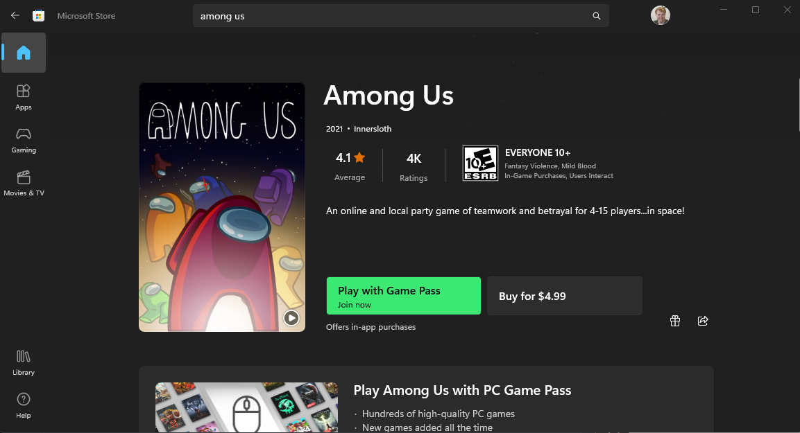

# Microsoft C&E Skilling 'Among Us' Event
> A Mary's Team Game!

## Introduction:

Hi Team! Today we’ll be holding a brief team event - playing some ‘Among Us’ (organized by Willie, Julia and I)! 🎉

In a similar vein to our ‘Minecraft’ events this is a casual team-building exercise through a free, cross-platform game.

Grab some coffee, prepare for the week, and install ‘Among Us’ on your platform of choice for a quick ~30 minute game 😊

## Among Us Game:

Here's the game trailer which includes a 43 second rough intro to the game:
https://youtu.be/0YKjFoGxbec

## Installation:

This article will outline the process of installing Among Us on a Windows machine via the MS Store, however the game is fully cross platform. Supported platforms include: Windows Store (PC), iOS/iPadOS, Android, Steam (PC), Xbox One, Playstation, Switch, etc. 

[!NOTE] On iOS and Android the game is free. On PC (MS Store/Steam) the game is $5, however it can be acquired for free using Xbox GamePass.

Microsoft Store Link: 
https://www.microsoft.com/store/productId/9NG07QJNK38J

## Joining the Game:

1. After successfully installing 'Among Us' launch the program. Once launched, accept the privacy policy to continue.

2. Sign in to your Xbox account.

3. Enter either your Date of Birth or any date older than 18 years ago (if you'd like to avoid entering the real date for privacy).

4. Click 'Sign In' to sign into your account. This won't prompt you for a sign in if you've already used an Xbox account from step 2.

You should see a "Success" pop up. Click 'Close'

5. Now you'll need to choose a friend code. This is randomly generated using the circular button on the right (1). Find a code you like, and press 'Confirm'.

You may recieve several pop-ups discussing updates and new in-game items. click 'Continue' or the 'X' in the upper left corner to dismiss them.

6. You should now be on the main menu! Click 'Online' to join the game.

7. Select the globe icon in the lower left corner.

Switch your region to 'North America' if it doesn't say so already.

8. Select 'Enter Code' under the 'Private' tab.

9. Enter the code supplied by the game host.

10. Success! You should now be in the lobby. From here, simply wait until all players have joined for the host to begin the game.

