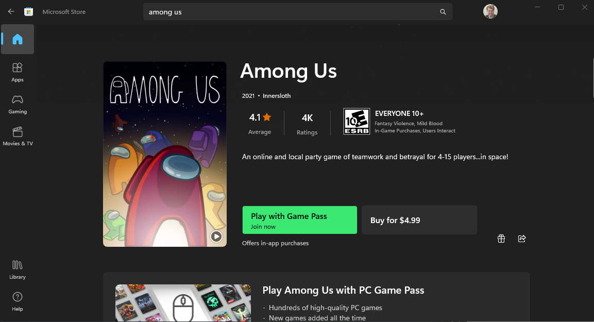

# Microsoft C&E Skilling Among Us Event
> A Mary's Team Game!

## Introduction:

Hi Team! Today we’ll be holding a brief team event - playing some ‘Among Us’ (organized by Willie, Julia and I)! 🎉

In a similar vein to our ‘Minecraft’ events this is a casual team-building exercise through a free, cross-platform game.

Grab some coffee, prepare for the week, and install ‘Among Us’ on your platform of choice for a quick ~30 minute game 😊

## Getting Started:

Here's the game trailer which includes a 43 second rough intro to the game:
https://youtu.be/0YKjFoGxbec

## Installing the Game:
This article will outline the process of installing Among Us on a Windows machine via the MS Store, however the game is fully cross platform. Supported platforms include: Windows Store (PC), iOS/iPadOS, Android, Steam (PC), Xbox One, Playstation, Switch, etc. 

[!NOTE] On iOS and Android the game is free. On PC (MS Store/Steam) the game is $5, however it can be acquired for free using Xbox GamePass.

Microsoft Store Link: 
https://www.microsoft.com/store/productId/9NG07QJNK38J

After successfully installing 'Among Us' launch the program.