# Installing Minecraft through the FTE GamePass Subscription

## Get your GamePass key

1. Go to the [Studios Tokens page](https://studiostokens.azurewebsites.net/) and login to your work account.
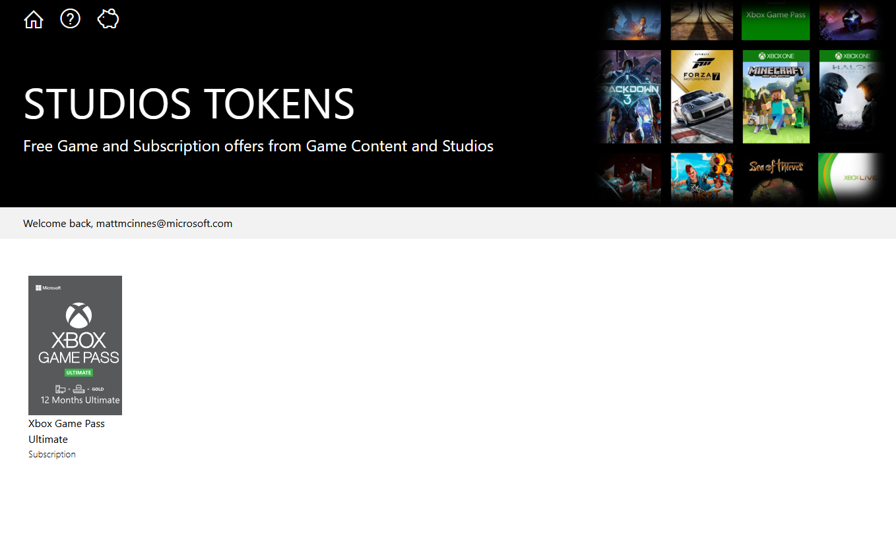

2. Click on the 'Xbox Game Pass Ultimate' item on the list. Click the green button labeled 'Get Token'. Next, click the 'Copy' icon to copy the code to your clipboard.
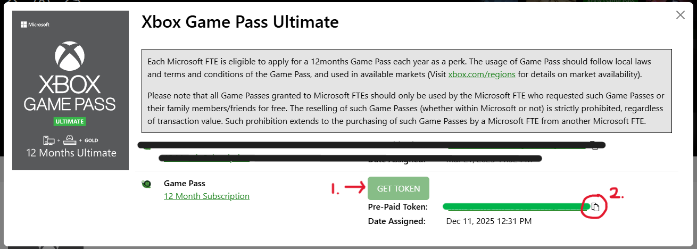

## Apply your key to a personal Microsoft account

Xbox logins are blocked for our main FTE accounts, so you'll have to login using a personal Microsoft account. If you don't want to use your primary personal account, [create a new Microsoft account here](https://account.microsoft.com/account)

1. Go to Minecraft.net's [Redeem Code Site](https://www.minecraft.net/en-us/msaprofile/redeem-code). Paste the 'Xbox Game Pass Ultimate' code from earlier and click 'Next'
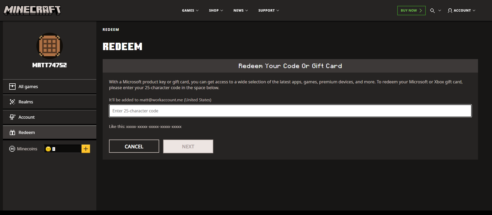

2. Once the code has been redeemed, your account should have access to the game.
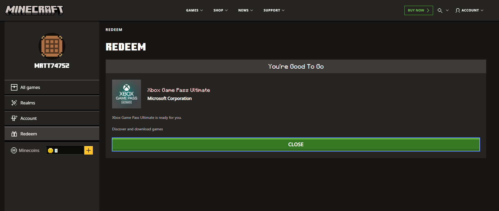

## Download Minecraft from the Microsoft Store

1. Open the Microsoft Store. In the search bar, type 'Minecraft' and select 'Minecraft Launcher'
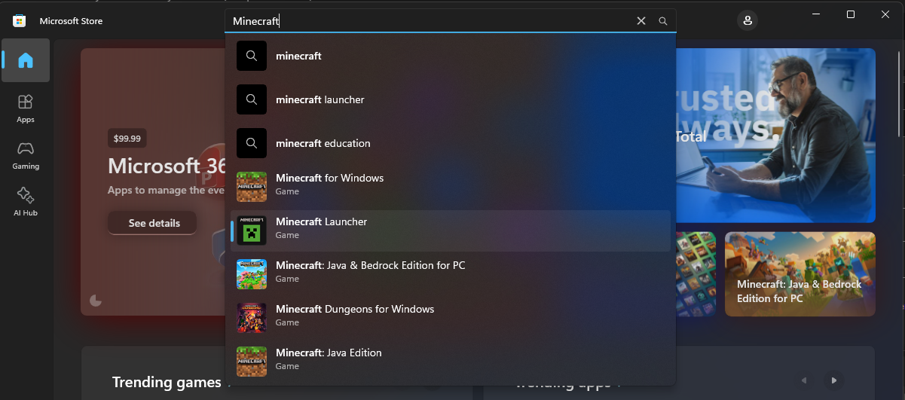

2. Click 'Download'. Once the launcher is installed, click 'Play'
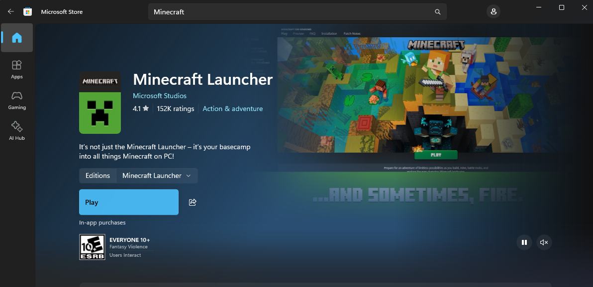

## Install Minecraft - Bedrock

3. Open the Minecraft launcher and click 'Sign in'
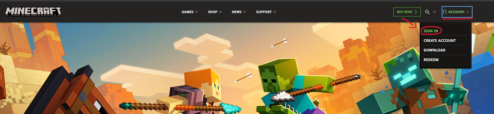

4. Sign in to the personal Microsoft account you redeemed the code to. 
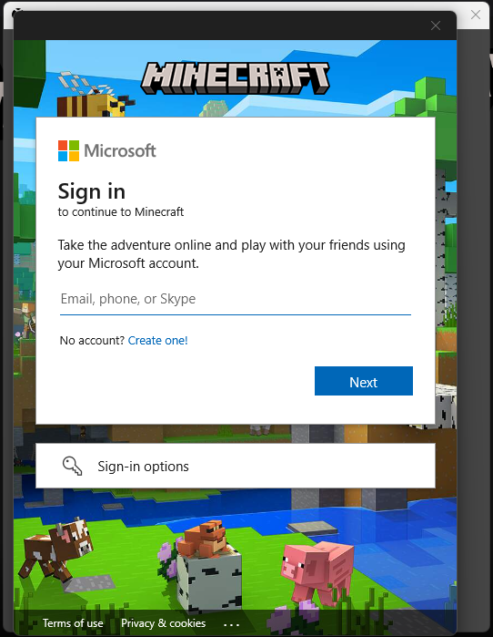

4. Once you're signed in, you'll likely see this error. Feel free to close it as it won't affect the game's functionality.
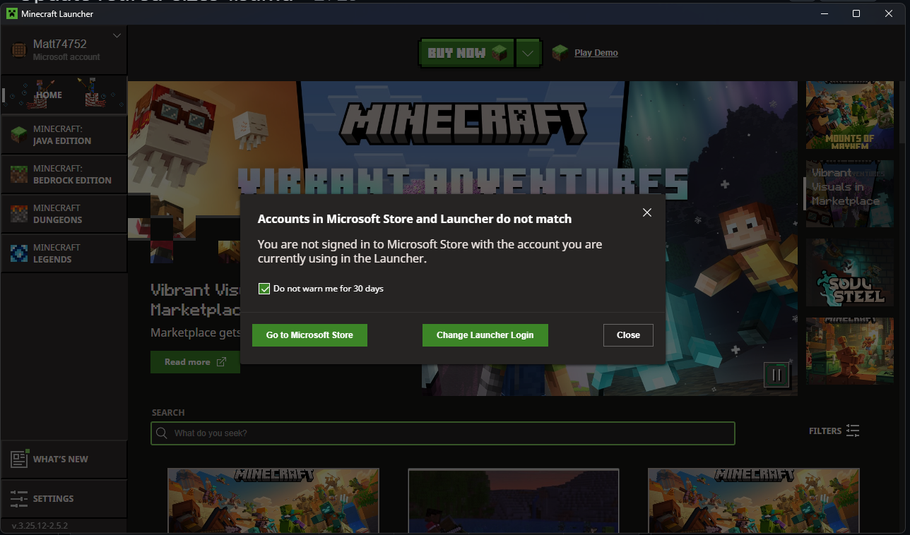

5. Select 'Minecraft: Bedrock Edition' on the side bar. Next, click 'Install'.
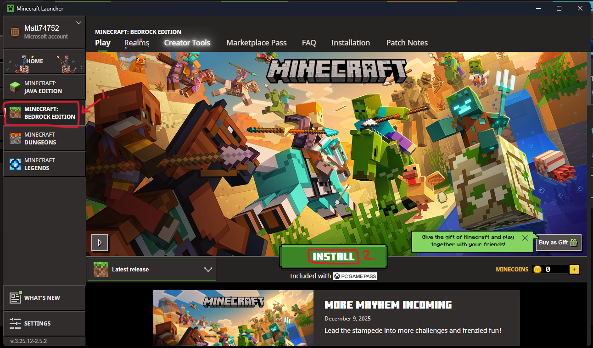

6. Done! Now sit back and wait for the game to install.
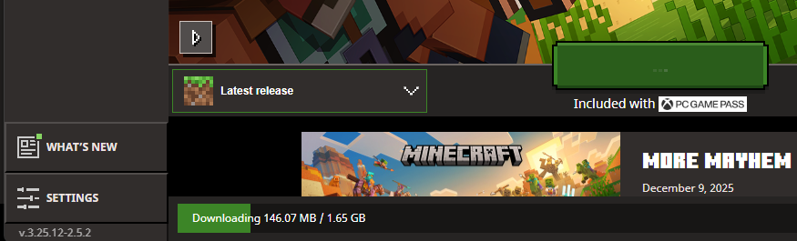

## Next Steps
Go follow the [Join Server](./JoinServer.md) tutorial to join the team's server.

