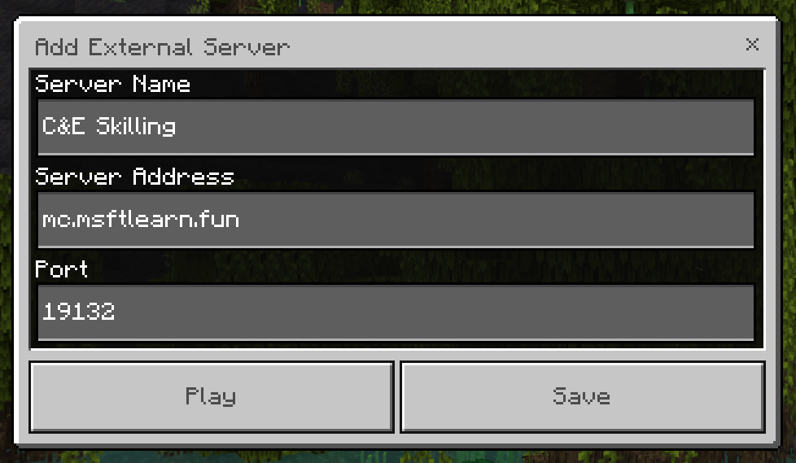

# Joining the C&E Skilling Minecraft Server

## Step 1: Getting Minecraft

### Download and Install:

Minecraft is divided into two 'Editions'. Our server runs the 'Minecraft for Windows' (aka 'Bedrock') edition of the game. 
To install Minecraft, download and run the ['Minecraft Launcher' Installer](https://launcher.mojang.com/download/MinecraftInstaller.msi) 

All Microsoft FTE's have access to Xbox GamePass which includes a copy of 'Minecraft Bedrock'. [Xbox GamePass](https://www.xbox.com/en-US/xbox-game-pass)

If you don't have access to a PC running Windows (10/11), Minecraft Bedrock is available on the Apple iOS App Store (iPhone/iPad Only), Google Play Store (Android), and APK Mirror (Linux w/ Android Emulator). It is not available on MacOS or Linux natively without emulators.  

Xbox (One/Series), PlayStation (4/5), and the Nintendo Switch have access to the game, but you can't join a custom server without some weird workarounds. You can add a user as a friend who is logged-in to the server and join them through the 'Friends' menu, but the server will not stay on your list after they leave the game. It does work as a temporary solution, but is likely only useful if you coordinate with another player using Windows.


### Launch the Game:

After successfully installing the 'Minecraft Launcher' and signing into your Microsoft Account, launch the program and select *'MINECRAFT for Windows'* on the left side. 


## Step 2: Connecting to the Server

### Add Server:

Once the game has started up, click **'Play'**


Click **'Servers'**


From here, scroll through the list of servers to find the **'Add Server'** button 


Since this is likely your first time booting up 'Minecraft', an 'Online Play' warning will appear. Select *'Do not show this screen again'* and then click **'Proceed'**


You should now see a menu titled 'Add External Server'. Put in the credentials as follows:

```
Server Name: C&E Skilling
Server Address: mc.msftlearn.fun
Port: 19132
```



Once added, click **'Save'**

### Join Server:

Once the server has been added, simply select it from the bottom of the list


Click **'Join Server'**. You should see a prompt that says 'Generating World' and 'Locating Server' with a loading animation


Success! You should be online! 

## After Joining:

Once connected to the server, feel free to roam around and begin your survival Minecraft experience!
