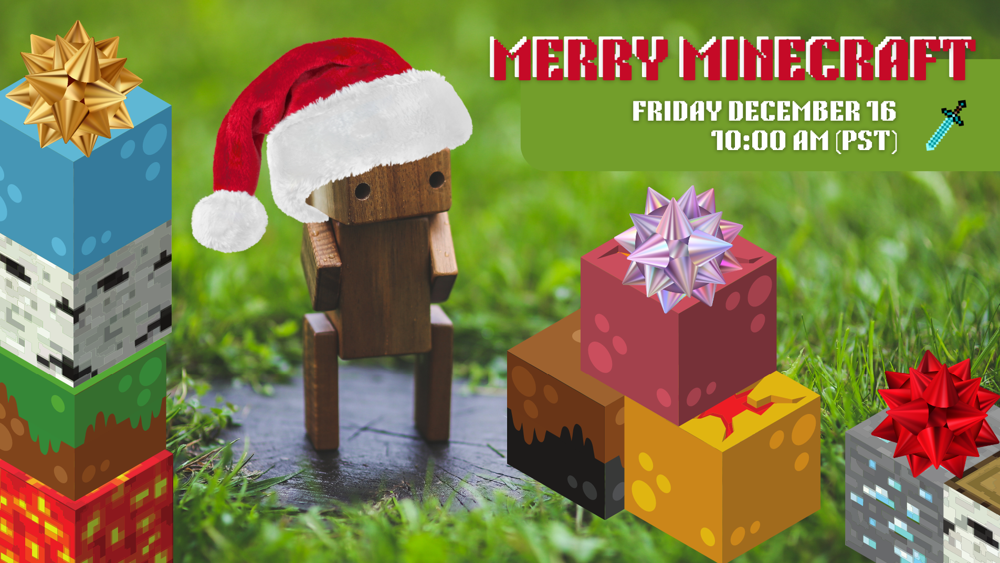

# Microsoft C&E Skilling Merry Minecraft
> An Azure Core Content Holiday Event!

## Introduction:

Hello, and welcome to the holiday season! Join us in celebrating with some good ol' Minecraft shenanigans!

This event is a fun, optional, no-pressure, with-people-but-also-can-be-done-async-on-your-own-as-you-like event for the C&E Skilling Org.

## Info and Getting Started:

The server will be a 'Survival' world on 'Easy' difficulty. A few members of the Skilling team have created a small village near the respawn point. Once you connect to the server, feel free to follow the path (or forge your own path) out of the village and begin your Minecraft adventure! 

[!NOTE] Before you continue, please read '[JoinServer.md](./JoinServer.md)' if you haven't done so already. This will go over installing 'Minecraft' and joining the server.

If you need assistance with anything in-game, hitting the 't' key will bring up a chat where you can ask other online players for assistance.

## Post-Event:

Once we have completed the ~60 minute 'Merry Minecraft' Event on Friday 12/16/22, the server will remain online if anyone chooses to continue playing in the future! 
