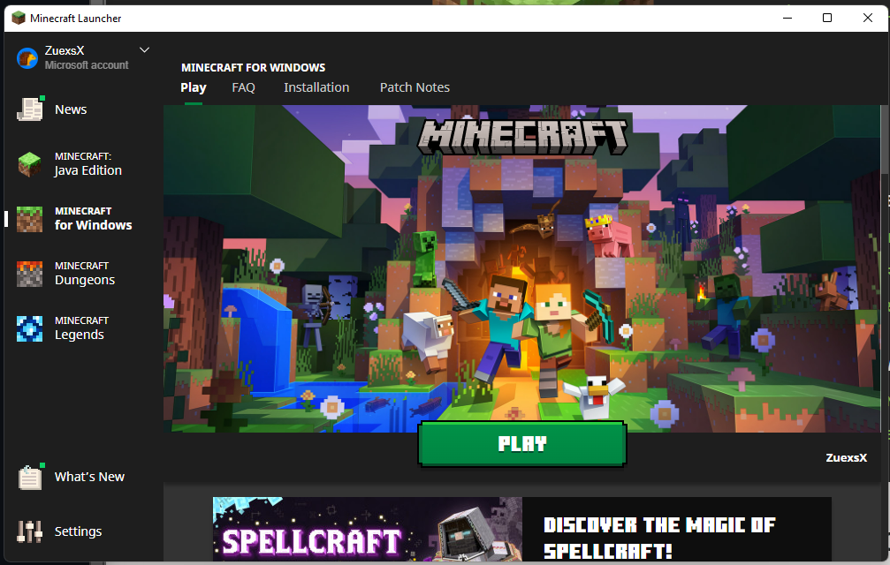
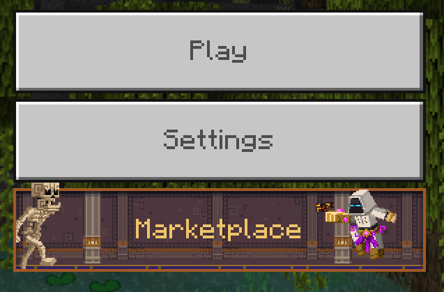
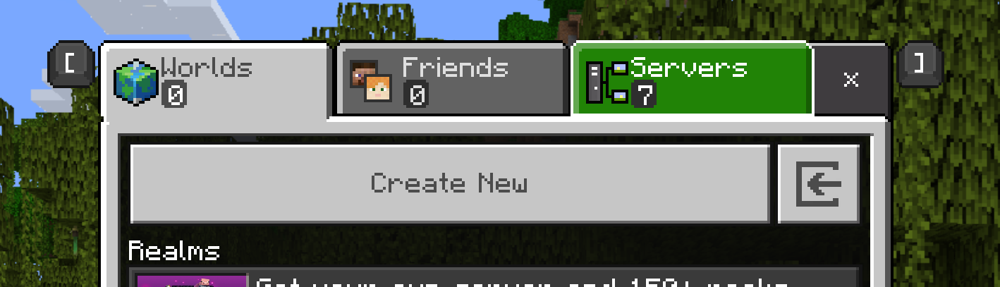
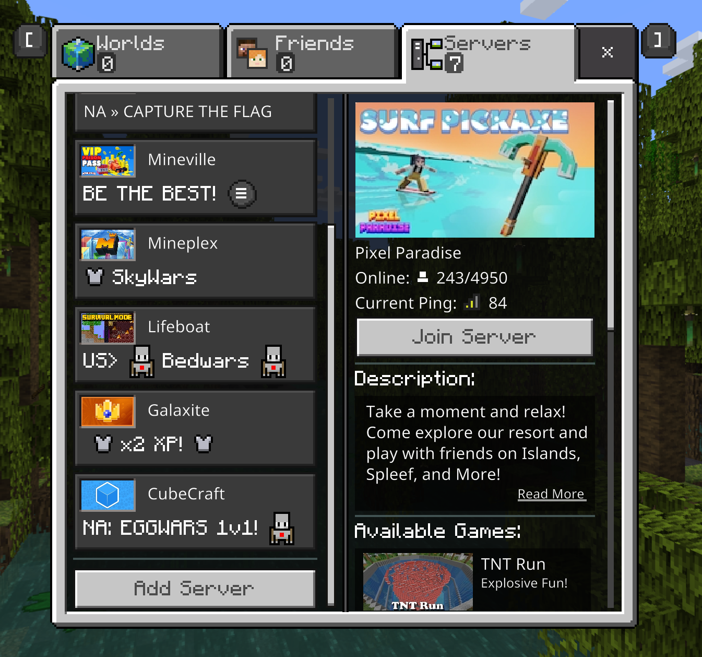
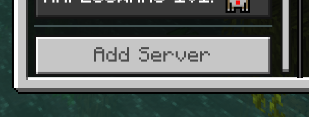
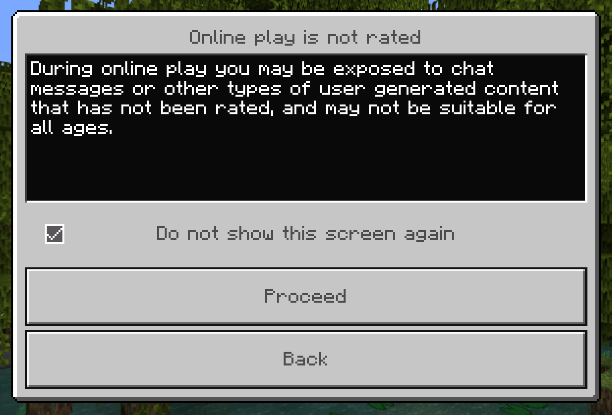
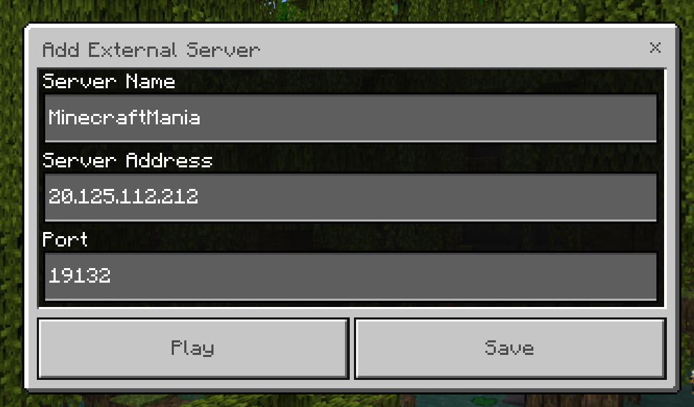
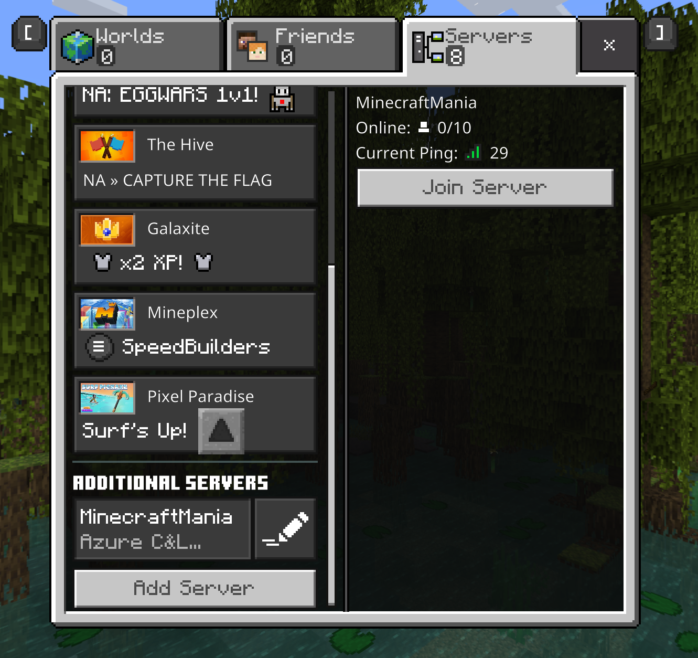
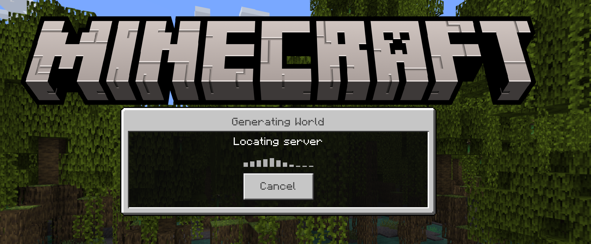

# Joining the Minecraft Mania Server

## Step 1: Getting Minecraft

### Download and Install:

Minecraft is divided into two 'Editions'. For 'Azure Minecraft Mania' we will be utilizing the 'Bedrock' (aka 'Minecraft for Windows') edition of the game. 
To install Minecraft, download and run the ['Minecraft Launcher' Installer](https://launcher.mojang.com/download/MinecraftInstaller.msi) 

All Microsoft FTE's have access to Xbox GamePass which includes a copy of 'Minecraft Bedrock'. [Xbox GamePass](https://www.xbox.com/en-US/xbox-game-pass)


### Launch the Game:

After successfully installing the 'Minecraft Launcher' and signing into your Microsoft Account, launch the program and select *'MINECRAFT for Windows'* on the left side. 




## Step 2: Connecting to the Server

### Add Server:

Once the game has started up, click **'Play'**



Click **'Servers'**



From here, scroll through the list of servers to find the **'Add Server'** button 





Since this is likely your first time booting up 'Minecraft', an 'Online Play' warning will appear. Select *'Do not show this screen again'* and then click **'Proceed'**



You should now see a menu titled 'Add External Server'. Put in the credentials as follows:

```
Server Name: MinecraftMania
Server Address: 20.125.112.212
Port: 19132
```



Once added, click **'Save'**

### Join Server:

Once the server has been added, simply select it from the bottom of the list



Click **'Join Server'**. You should see a prompt that says 'Generating World' and 'Locating Server' with a loading animation



Success! You should be online! 

## After Joining:

Once connected to the server, please wait for other players to join to begin the Minecraft Mania!
